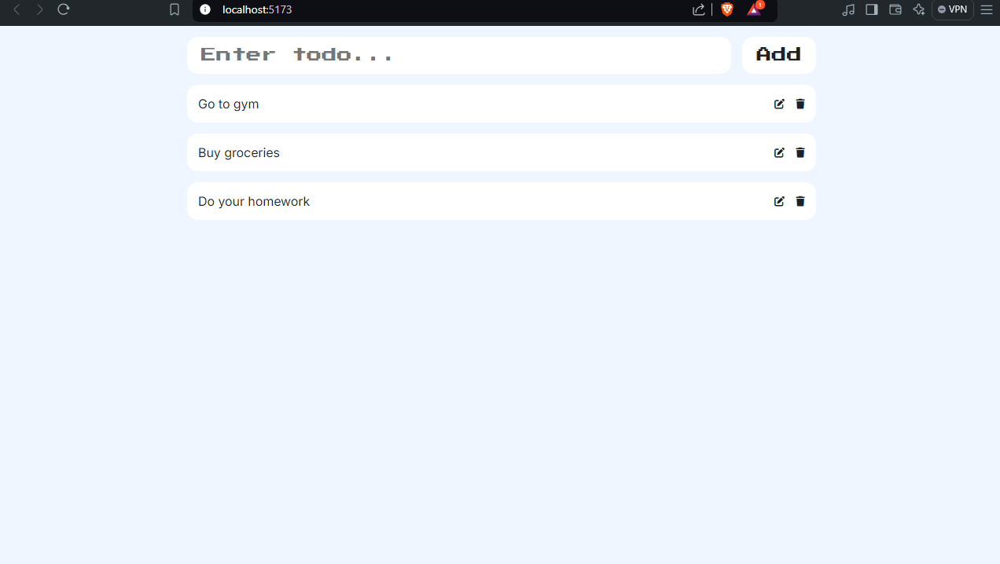

# Todo App in React

This is the website I made watching this tutorial (<a href="https://www.youtube.com/watch?v=82PXenL4MGg">link</a>). If you think of any issues with code please let me know 😊.

## Deployment

To deploy the website run these commands

```sh {"id":"01J88E7PFZREMHVBAK9PHVE94J"}
    #This sets up the fast node manager environment (Window Powershell)
    fnm env --use-on-cd --shell power-shell | Out-String | Invoke-Expression

    #This is the setup for bash
    #eval "$(fnm env --use-on-cd --shell bash)"

    #This sets the node version
    fnm use --install-if-missing 20

    #This will start the website
    npm run dev
```

# Screenshot

This how the website will look when you click on the local host.

</img>
